# Caracterización de rechazos en Pull Requests que modifican configuración de CI/CD generados por agentes de IA

---

## 1. Motivación

La creciente adopción de agentes de IA en flujos de desarrollo real hace que esta pregunta tenga consecuencias prácticas inmediatas. Los equipos que integran estos agentes no cuentan con evidencia empírica para decidir qué agente delegar para tareas CI/CD, qué aspectos de esos cambios revisar con mayor cuidado, ni cómo orientar al agente para producir configuraciones aceptables. A su vez, los mantenedores de proyectos se enfrentan a PRs CI/CD generados automáticamente sin disponer de patrones documentados que faciliten su revisión. Caracterizar los rechazos en estos PRs es un primer paso necesario para que tanto equipos como revisores puedan tomar decisiones informadas.

## 2. Problema

Los agentes de IA generan cambios sobre configuración CI/CD que son cerrados sin merge. Sin embargo, no existe una razon de los rechazos ni evidencia de si esos motivos difieren entre agentes.

## 3. Objetivo de la investigación

### 3.1 Objetivo general

Caracterizar empíricamente los motivos por los cuales los PRs que modifican configuración CI/CD generados por agentes de IA son cerrados sin merge.

### 3.2 Objetivos específicos

1. Construir un conjunto de PRs cerrados sin merge que modifiquen archivos CI/CD.
2. Aplicar card sorting para derivar categorías de rechazo desde la evidencia disponible en cada PR.
3. Consolidar un codebook único mediante doble codificación y resolución de desacuerdos.
4. Organizar las categorías finales en una taxonomía jerárquica de motivos de rechazo.
5. Reportar la distribución descriptiva de los motivos de rechazo y sus implicancias para desarrolladores, investigadores y constructores de herramientas.

## 4. Pregunta de investigación

**RQ1.** ¿Qué categorías de motivos de rechazo emergen al aplicar card sorting sobre PRs cerrados sin merge que modifican configuración CI/CD generados por agentes de IA?

De forma descriptiva, el estudio también permite observar cómo se distribuyen estas categorías entre agentes, siempre evitando interpretar las frecuencias como una medida directa de calidad del agente sin controlar por repositorio, tarea, contexto y disponibilidad de evidencia.

## 5. Diseño metodológico

### 5.1 Conjunto de datos

#### 5.1.1 Fuente de datos

Se utiliza la variante **AIDev-pop** —repositorios con al menos 100 estrellas— porque ofrece señales de revisión más completas y reduce la probabilidad de analizar repositorios de prueba o baja actividad.

#### 5.1.2 Tablas utilizadas

| Tabla | Columnas explotadas |
|---|---|
| `pull_request` | `id`, `state`, `merged_at`, `closed_at`, `created_at`, `agent`, `repo_url`, `html_url`, `title`, `body` |
| `human_pull_request` | mismas columnas (baseline humano) |
| `pr_commit_details` | `pr_id`, `filename`, `status`, `additions`, `deletions`, `changes`, `message`, `patch` |
| `pr_reviews` | `pr_id`, `state`, `body` |
| `pr_review_comments_v2` | `pr_id`, `body` |
| `pr_comments` | `pr_id`, `body` |
| `pr_timeline` | `pr_id`, `event` |

#### 5.1.3 Cadena de filtros

| Paso | Filtro | Resultado | % del universo F0 |
|---|---|---:|---:|
| F0 | Universo: tabla `pull_request` en AIDev-pop | ~33 600 PRs | 100 % |
| F1 | El PR modifica al menos un archivo CI/CD | ~2 376 PRs | ~7,1 % |
| F2 | PR cerrado sin merge: `state == closed AND merged_at IS NULL` | ~454 PRs | ~1,4 % |
| F3 | Deduplicación: un registro por PR | ~454 PRs únicos | ~1,4 % |
| F4 | El PR modifica exactamente un archivo CI/CD | 269 PRs | ~0,8 % |

El análisis actual se realiza sobre F4, porque reduce ruido al observar un único archivo CI/CD por PR.

#### 5.1.4 Patrones de filename considerados CI/CD

```text
.github/workflows/.*\.ya?ml
.gitlab-ci\.ya?ml
.circleci/config\.ya?ml
Jenkinsfile(\..+)?
azure-pipelines\.ya?ml
.travis\.ya?ml
bitbucket-pipelines\.ya?ml
.drone\.ya?ml
buildkite\.ya?ml
appveyor\.ya?ml
```

#### 5.1.5 Definición operacional de estado

- **Aceptado:** `merged_at IS NOT NULL`.
- **Rechazado (cerrado sin merge):** `state == 'closed' AND merged_at IS NULL`.
- **Abierto:** `state == 'open'` (excluido del análisis principal).

Se discute explícitamente en *Amenazas a la Validez* que "cerrado sin merge" no equivale necesariamente a "rechazado por mala calidad"; puede reflejar abandono, superación por otro PR o reorganización del proyecto.

### 5.2 Metodología para la Construcción de la Taxonomía

#### 5.2.1 Fundamentación metodológica

La construcción de la taxonomía se basa en **card sorting**, técnica cualitativa usada para pasar desde elementos textuales o artefactos individuales hacia temas, categorías y jerarquías interpretables. Zimmermann describe el card sorting como un proceso para derivar taxonomías desde datos y organizar temas en niveles de abstracción. El proceso contempla preparación, ejecución y análisis, y en la fase final se revisan los grupos para deducir categorías más generales.

El diseño sigue tres ideas metodológicas principales:

1. **Un caso por tarjeta.** Cada PR corresponde a una tarjeta con identificador único, evidencia del cambio CI/CD, contexto del PR y señales de revisión.
2. **Codificación abierta inicial.** Las categorías emergen desde los datos, en lugar de imponer un esquema rígido desde el inicio.
3. **Consolidación jerárquica.** Las categorías de detalle se agrupan en familias raíz para formar una taxonomía, siguiendo el principio usado en estudios empíricos que derivan catálogos o taxonomías a partir de codificación manual.

Esta decisión se inspira en trabajos previos de Ingeniería de Software empírica: Wen et al. derivan una taxonomía jerárquica mediante análisis manual de commits; Begel y Zimmermann agrupan respuestas abiertas en categorías mediante card sorting; y Liang et al. consolidan códigos cualitativos en un codebook compartido antes de aplicar el análisis final.

#### 5.2.2 Material por tarjeta

Cada tarjeta corresponde a un PR cerrado sin merge y contiene:

| Tipo de evidencia | Campos utilizados | Uso en la codificación |
|---|---|---|
| Evidencia primaria del cambio CI/CD | `filename`, `patch`, `message` | Determinar qué modificación CI/CD propuso el agente. |
| Contexto del PR | `title`, `body`, `html_url`, `repo_url` | Entender intención declarada, alcance y repositorio afectado. |
| Señales de revisión | reviews, review comments, comments, timeline | Identificar razones explícitas o implícitas del cierre. |
| Identificación | `pr_id`, `agent` | Trazabilidad y análisis descriptivo posterior. |

Se privilegia la evidencia del diff y de la conversación del PR por sobre el título o el mensaje de commit aislado.

#### 5.2.3 Protocolo de codificación

El proceso aplicado fue híbrido:

1. **Card sorting abierto.** Dos codificadores clasificaron PRs de manera independiente, proponiendo etiquetas sin un codebook cerrado.
2. **Comparación intercodificador.** Se compararon ambas categorizaciones por `pr_id`, identificando acuerdos, desacuerdos conceptuales, diferencias de granularidad y casos de dato faltante.
3. **Resolución de discusión.** Para cada desacuerdo se seleccionó una sola categoría final. La regla principal fue priorizar la causa sustantiva del rechazo por sobre el mecanismo de cierre cuando existía evidencia suficiente.
4. **Codebook único.** Las categorías finales se consolidaron en un único libro de códigos con definición, ejemplos de evidencia, notas de codificación y criterio final de uso.
5. **Taxonomía.** Las categorías del codebook se organizaron en familias raíz para producir un árbol de clasificación.

#### 5.2.4 Reglas de resolución de desacuerdos

| Situación | Regla aplicada |
|---|---|
| Una categoría describe causa técnica y otra describe mecanismo de cierre | Priorizar la causa técnica si la evidencia es clara. |
| Una categoría es general y otra es específica dentro de CI/CD | Priorizar la categoría CI/CD más específica. |
| Un codificador marca dato faltante y el otro entrega evidencia verificable | Usar la categoría con evidencia disponible. |
| Hay evidencia explícita de reemplazo, postergación o cierre voluntario | Conservar la categoría de proceso correspondiente. |
| No hay evidencia suficiente en ninguna codificación | Usar C00 o C12, según corresponda. |

## 6. Resultados actuales

### 6.1 Resolución final de la categorización

| Métrica | Valor |
|---|---:|
| PRs resueltos | 269 |
| Categorías del codebook | 19 |
| Casos que ya estaban en acuerdo | 40 |
| Casos de discusión resueltos | 229 |
| Categorías tomadas desde Camilo | 249 |
| Categorías tomadas desde Gonzalo | 20 |

### 6.2 Distribución por familia taxonómica

| Familia | n | % |
|---|---:|---:|
| F1. CI/CD y validación automática | 97 | 36.1% |
| F2. Riesgo, gobernanza y operación | 76 | 28.3% |
| F3. Revisión, integración y evolución | 62 | 23.0% |
| F4. Adecuación técnica y alcance del cambio | 16 | 5.9% |
| F5. Cierre sin causa verificable o experimental | 18 | 6.7% |

La familia más frecuente es **Fallas de CI/CD**, lo que es esperable debido al criterio de selección del conjunto de datos: todos los PRs analizados modifican al menos un archivo de configuración CI/CD. Sin embargo, la taxonomía muestra que el cierre sin merge no se explica únicamente por fallos del pipeline; también aparecen razones de alcance, reemplazo, obsolescencia, falta de contexto y dinámica del proceso de revisión.

### 6.3 Taxonomía de motivos de rechazo

```mermaid
graph TD
    A[Motivos de rechazo en PRs CI/CD generados por agentes de IA]
    A --> F1[CI/CD y validación automática<br/>97 casos]
    F1 --> C04[C04 Falla de CI/CD<br/>92]
    F1 --> C16[C16 Validación insuficiente<br/>5]
    A --> F2[Riesgo, gobernanza y operación<br/>76 casos]
    F2 --> C12[C12 Política/gobernanza<br/>39]
    F2 --> C13[C13 Seguridad/permisos<br/>7]
    F2 --> C14[C14 Toolchain/dependencias<br/>21]
    F2 --> C15[C15 Release/deploy<br/>9]
    A --> F3[Revisión, integración y evolución<br/>62 casos]
    F3 --> C05[C05 Reemplazado o duplicado<br/>33]
    F3 --> C06[C06 Abandono/iteración incompleta<br/>6]
    F3 --> C07[C07 Conflicto/rebase/historial<br/>11]
    F3 --> C08[C08 Cambio difícil de revisar<br/>9]
    F3 --> C09[C09 Cambio obsoleto<br/>2]
    F3 --> C19[C19 Pospuesto<br/>1]
    A --> F4[Adecuación técnica y alcance del cambio<br/>16 casos]
    F4 --> C10[C10 Diagnóstico/solución incorrecta<br/>5]
    F4 --> C11[C11 Desacuerdo de diseño<br/>5]
    F4 --> C17[C17 Fuera del foco CI/CD<br/>6]
    A --> F5[Cierre sin causa verificable o experimental<br/>18 casos]
    F5 --> C01[C01 Cierre sin evidencia<br/>10]
    F5 --> C02[C02 Causa no determinable<br/>0]
    F5 --> C03[C03 Fuente no disponible<br/>1]
    F5 --> C18[C18 Experimento/WIP<br/>7]
```



## 6.4 Interpretación de la taxonomía

La taxonomía separa dos planos. El primero corresponde a **causas sustantivas**, como fallas de CI/CD, riesgos de seguridad, cambios de toolchain, errores de diagnóstico o desacuerdos de diseño. El segundo corresponde a **dinámicas de cierre**, como abandono, reemplazo, cierre silencioso, PR experimental o fuente no disponible.

Esta separación evita interpretar todo cierre sin merge como mala calidad técnica. Un PR puede cerrarse porque efectivamente rompe CI, pero también porque fue reemplazado por otro PR, porque no cumplía una regla administrativa, porque el cambio quedó obsoleto o porque la evidencia pública no permite conocer la causa.

## 7. Implicancias

### 7.1 Para desarrolladores y mantenedores

Los resultados sugieren revisar tempranamente si el PR generado por IA realmente ejecuta el workflow propuesto, si respeta políticas del repositorio, si introduce riesgos de permisos/secrets, si el diff es revisable y si la solución corresponde al problema real.


### 7.2 Para investigadores

La taxonomía entrega una base empírica para estudiar fallas de agentes de IA en tareas CI/CD. También permite comparar agentes de forma descriptiva, siempre controlando por repositorio, tipo de tarea y evidencia disponible.

### 7.3 Para constructores de herramientas

Los resultados apuntan a mejoras concretas: validación previa de workflows, detección de cambios demasiado grandes, advertencias sobre permisos peligrosos, verificación de compatibilidad de dependencias, reconocimiento de políticas del repositorio y mejor alineación entre la propuesta del agente y el contexto del proyecto.


## 8. Referencias

[1] F. Wen, C. Nagy, M. Lanza y G. Bavota, “An Empirical Study of Quick Remedy Commits”, en *Proc. 28th International Conference on Program Comprehension (ICPC '20)*, 2020, pp. 1–12. doi: 10.1145/3387904.3389266.

[2] J. T. Liang, C. Yang y B. A. Myers, “A Large-Scale Survey on the Usability of AI Programming Assistants: Successes and Challenges”, en *Proc. IEEE/ACM 46th International Conference on Software Engineering (ICSE '24)*, 2024. doi: 10.1145/3597503.3608128.

[3] A. Begel y T. Zimmermann, “Analyze This! 145 Questions for Data Scientists in Software Engineering”, en *Proc. 36th International Conference on Software Engineering (ICSE '14)*, 2014, pp. 12–23. doi: 10.1145/2568225.2568233.

[4] T. Zimmermann, “Card-sorting: From Text to Themes”, en *Perspectives on Data Science for Software Engineering*, Morgan Kaufmann, 2016, pp. 137–141.
